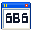

# Görkem Berk Gündoğdu — Windows XP Portfolio

Interactive Windows XP Desktop & Mobile Modal portfolio built with **Astro**, **React**, **Tailwind CSS**, **Framer Motion**, **GSAP**, and **Zustand**.



## 🖥️ Concept & UX
- **Desktop**: Free-floating draggable retro Windows XP Luna windows with z-index stacking, dual-column Start menu, and authentic taskbar.
- **Mobile**: Responsive slide-up modal UX eliminating drag friction for smooth touch interaction.
- **Boot Flow**: Auto-opens `Gorkem_Berk_Beni_Oku.txt` on startup.

## 🚀 Tech Stack
- **Framework**: [Astro](https://astro.build/) + [React](https://react.dev/)
- **Styling**: [Tailwind CSS](https://tailwindcss.com/)
- **Animation & Motion**: [Framer Motion](https://www.framer.com/motion/) + [GSAP](https://greensock.com/gsap/)
- **State Management**: [Zustand](https://zustand-demo.pmnd.rs/)

## 🛠️ Development

```bash
# Install dependencies
npm install

# Start local dev server
npm run dev

# Production build
npm run build

# Preview build
npm run preview
```

## 📄 License
MIT © [Görkem Berk Gündoğdu](https://github.com/gorkemberkgundogdu-alt)
